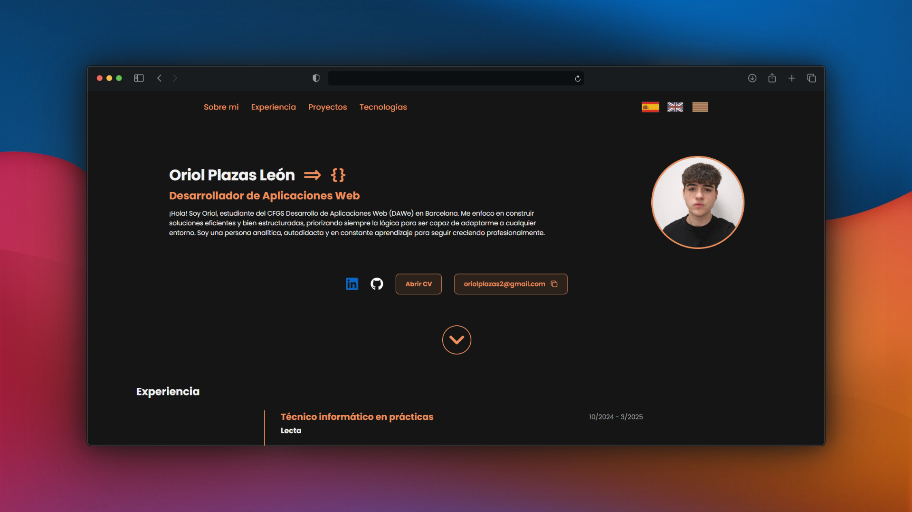

# My Portfolio
#### A clean, modern-looked portfolio web page with About, Experience, Projects and TechStack sections



## 🌐 Live Demo
**Visit my portfolio: [https://oriolplazas.vercel.app](https://oriolplazas.vercel.app)**

## 🛠️ Tech Stack
- **Vue 3**
- **TypeScript**
- **Vite**

## 📁 Project Structure

```
portfolio/
├── public/
│   ├── fonts/              # Custom fonts
│   ├── icons/              # SVG icons
│   └── mockups/            # Project mockup images
├── src/
│   ├── components/         # Vue components
│   │   ├── header/
│   │   │   ├── HeaderNav.vue
│   │   │   └── HeaderLanguages.vue
│   │   ├── hero/
│   │   │   ├── HeroCtas.vue
│   │   │   └── HeroGoDown.vue
│   │   ├── techStack/
│   │   │   └── TechFront.vue
│   │   ├── PortfolioHeader.vue
│   │   ├── PortfolioHero.vue
│   │   ├── PortfolioExperience.vue
│   │   ├── PortfolioProjects.vue
│   │   └── PortfolioTechStack.vue
│   ├── views/
│   │   └── Portfolio.vue   # Main view
│   ├── data/               # Data & models (interfaces)
│   │   ├── model/
│   │   │   ├── Job.ts
│   │   │   ├── Project.ts
│   │   │   └── TechCategory.ts
│   │   │   └── TechItem.ts
│   │   ├── experience.ts
│   │   ├── projects.ts
│   │   └── techStack.ts
│   ├── i18n/               # Language (internationalization)
│   │   ├── langController.ts
│   │   └── lang/
│   │       ├── en.ts
│   │       ├── es.ts
│   │       └── cat.ts
│   ├── utils/
│   │   └── navigation.ts
│   ├── styles/
│   │   └── root.css        # Global styles & CSS variables
│   ├── assets/             # Images & static assets
│   ├── App.vue
│   └── main.ts
├── package.json
├── tsconfig.json
├── vite.config.ts
└── index.html

